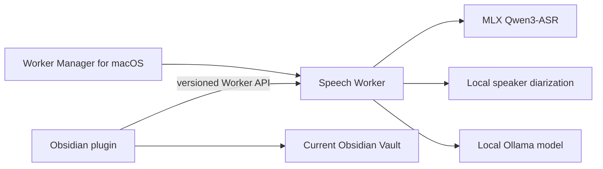

# Speech Capture

Speech Capture is a local-first Obsidian system for turning large audio files into complete transcripts, readable structured notes, and evidence-linked records that future agents can consume safely.

> **Project status:** design baseline. There is no installable release yet.

## Product goals

- Preserve the complete decodable content of the source audio.
- Prefer models running on a user-owned Apple Silicon Mac.
- Distinguish speakers in meetings, interviews, and other multi-speaker recordings.
- Show progressive transcription results without treating previews as final evidence.
- Produce useful summaries whose important claims link back to transcript evidence.
- Keep the processing system independent from Google Drive, iCloud, Dropbox, Obsidian Sync, or any other Vault synchronization provider.
- Continue long-running jobs after Obsidian or the submitting laptop is closed.

## System shape

Speech Capture is not only an Obsidian plugin. It is a small local system with three cooperating parts:



- **Obsidian plugin:** submission, progress, transcript review, corrections, and Vault publishing.
- **Speech Worker:** durable uploads, job queue, model orchestration, resource checks, recovery, and artifact storage.
- **Worker Manager:** one-time setup, model downloads, status, updates, and background-service control on macOS.

The V1 Worker targets Apple Silicon Macs. The plugin protocol is designed so other Worker backends can be added later.

## Design principles

1. **Local first:** cloud APIs are optional, disabled by default, and require explicit per-task consent.
2. **Evidence before summary:** the immutable ASR response and evidence transcript exist independently from generated notes.
3. **No silent loss:** every decodable time range receives an explicit processing outcome.
4. **Processed is not published:** Worker completion and successful Vault publication are separate states.
5. **Provider independent:** Vault sync is not the task transport protocol.
6. **Human control:** speaker names, transcript corrections, and inferred information remain reviewable and reversible.
7. **Resumable by design:** uploads, transcription chunks, jobs, and publication attempts survive disconnects and restarts.

## Documentation

- [Product requirements](docs/product-requirements.md)
- [System architecture](docs/architecture.md)
- [Worker API direction](docs/worker-api.md)
- [Data model and output package](docs/data-model-and-output.md)
- [Security, privacy, and recovery](docs/security-privacy-and-recovery.md)
- [Testing strategy](docs/testing-strategy.md)
- [UI direction](docs/ui-direction.md)
- [Decision log](docs/decision-log.md)
- [Roadmap](docs/roadmap.md)
- [Reference projects](docs/references.md)

## Repository layout

```text
apps/
  obsidian-plugin/       Obsidian client
  worker-manager/        Native macOS setup and management app
services/
  speech-worker/         Python processing service
packages/
  protocol/              Shared schemas and generated client types
docs/                    Product and engineering design
```

## Planned technology

- TypeScript and the Obsidian API for the plugin.
- Python 3.11, FastAPI, SQLite, MLX, pyannote, and Ollama for the Worker.
- SwiftUI for the macOS Worker Manager.
- OpenAPI and JSON Schema for the versioned protocol and artifacts.
- `pnpm` for the TypeScript workspace and `uv` for Python dependency management.

## Privacy

Speech Capture is designed to process audio locally. Private audio, transcripts, model credentials, pairing tokens, runtime databases, and diagnostic logs must never be committed to this repository.

See [Security, privacy, and recovery](docs/security-privacy-and-recovery.md) and [SECURITY.md](SECURITY.md).

## License

本项目采用 [PolyForm Noncommercial License 1.0.0](LICENSE)。

个人学习、研究、测试、非商业实验以及许可证明确允许的非商业用途可以免费使用、修改和分发。将本项目用于商业产品、商业服务、收费交付、企业内部商业运营、转售、商业再许可，或其他使组织获得商业利益的场景，需要事先取得作者的单独书面许可。

这不是 MIT License，也不是允许商业使用的 OSI 开源许可证。
