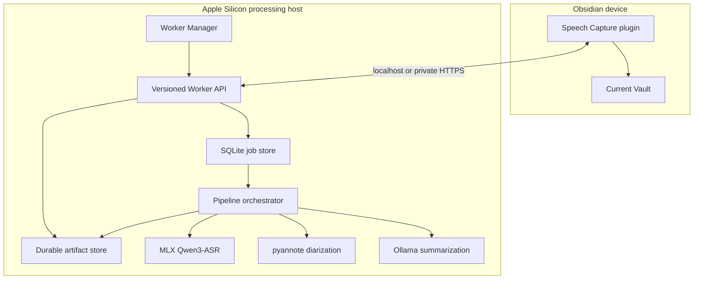
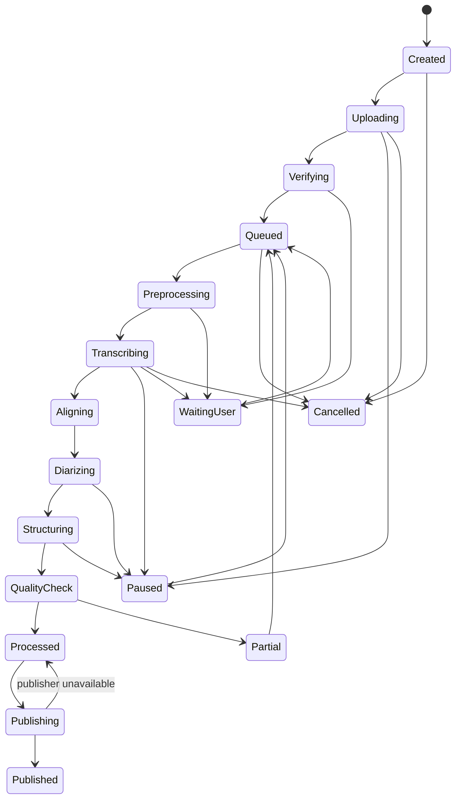

# System Architecture

## 1. Overview

Speech Capture separates the Obsidian user experience from long-running model execution.

The plugin never owns the model process. The Worker never assumes that a particular cloud-drive client is running.

## 2. Components

### 2.1 Obsidian plugin

Responsibilities:

- discover or configure Workers;
- pair devices;
- inspect Worker capabilities;
- prepare source metadata and resumable uploads;
- create and control jobs;
- render progress and transcript previews;
- review speaker labels and corrections;
- claim publication ownership;
- write and verify Vault artifacts atomically;
- preserve user-authored sections.

The plugin stores non-secret preferences in plugin settings. Device secrets stay in operating-system-protected storage rather than the synchronized Vault.

### 2.2 Speech Worker

Responsibilities:

- authenticate paired clients;
- maintain upload and job state;
- validate complete media before processing;
- perform resource preflight;
- orchestrate ASR, alignment, diarization, classification, summarization, and quality checks;
- persist chunk checkpoints and event history;
- retain completed artifacts until publication;
- support pause, resume, retry, cancel, and restart recovery;
- issue one publication lease per job and Vault;
- expose redacted diagnostics.

The Worker runs as a macOS background service. It does not require Obsidian or a graphical window to stay open.

### 2.3 Worker Manager

The native macOS manager provides:

- first-run hardware and disk checks;
- background-service installation and removal;
- ASR, aligner, and diarization model download;
- Hugging Face authorization guidance for pyannote;
- Ollama model detection and installation guidance;
- pairing-code display;
- status, update, rollback, logs, and uninstall controls.

The manager can close without stopping the Worker.

### 2.4 Shared protocol

The protocol package owns:

- OpenAPI definitions;
- JSON Schemas;
- stable enums and error codes;
- generated TypeScript and Python types;
- protocol compatibility tests.

See [Worker API direction](worker-api.md).

## 3. Local and remote operation

### 3.1 Local

The plugin calls the Worker over loopback. The security and job model remain the same as remote operation so the implementation does not split into two incompatible pipelines.

### 3.2 Remote

The plugin calls a user-configured HTTPS endpoint. Tailscale is the recommended V1 private network, but the plugin stores only a Worker URL and device credential.

Other private-network solutions can supply the same endpoint without code changes.

Remote desktop access is not part of the workflow.

### 3.3 Pre-login behavior

Worker and remote-network components must run as system services if processing is expected before a graphical user session exists.

This does not bypass disk encryption:

- if the system disk is available after boot, the services can start;
- if FileVault requires an unlock, neither Worker nor models can run until the disk is unlocked;
- provider-specific desktop sync clients may still require a user session, which is why they are not part of the processing transport.

## 4. Job lifecycle

Terminal labels such as `failed`, `partial`, and `cancelled` always preserve completed checkpoints and an actionable reason.

## 5. Media intake

1. The client creates an upload manifest containing source size, media type, and whole-file checksum.
2. The Worker returns required upload chunks.
3. The client sends missing chunks with per-chunk checksums.
4. The Worker assembles into staging and verifies the whole-file checksum.
5. FFmpeg or the native decoder validates duration and decodability.
6. Only a verified source can enter the processing queue.

The Worker may create normalized temporary audio, but it never modifies the user's original file.

## 6. Transcription and progressive preview

The Worker processes durable audio ranges and emits sequenced events.

- A completed range is committed to SQLite and the artifact store before an event is emitted.
- The active tail is marked provisional because sentence boundaries may cross chunks.
- Stable ranges are not rewritten without an explicit revision event.
- Speaker labels may arrive after text and are represented as a separate attribution revision.
- Reconnecting clients request a snapshot and resume from the last event sequence number.
- Server-sent events are preferred for updates; bounded polling is the compatibility fallback.

The Vault receives only low-frequency job status updates during processing. Formal Markdown is published atomically after quality checks.

## 7. Model pipeline

### 7.1 ASR

- Default accuracy profile: Qwen3-ASR 1.7B.
- Optional speed profile: Qwen3-ASR 0.6B.
- Domain vocabulary context combines confirmed Vault and job terms.
- Automatic language detection is the default.
- The immutable raw model response is stored before cleanup.

### 7.2 Alignment

The forced aligner produces stable word or phrase timing. Timestamp monotonicity and media-bound checks are part of the quality gate.

### 7.3 Speaker diarization

Pyannote assigns anonymous speakers within one recording. A missing diarization model degrades the speaker-label feature but does not discard transcription.

V1 does not compare voice embeddings across recordings.

### 7.4 Classification and summarization

The Worker classifies content type and traits, then performs hierarchical summarization:

1. analyze every transcript chunk;
2. create evidence-linked chunk findings;
3. merge findings by content type;
4. validate important statements against evidence;
5. render deterministic Markdown from validated structured data.

The summarizer cannot alter the immutable raw ASR payload.

## 8. Persistence and recovery

SQLite stores:

- Workers, paired devices, and Vault identities;
- upload manifests and chunk receipt;
- jobs, attempts, and state transitions;
- transcript segments and revisions;
- event cursors;
- publication leases and acknowledgements;
- model and prompt provenance.

Large binary content and artifacts live in a dedicated Worker application-data directory. Database writes and artifact manifests use atomic replace patterns.

On restart:

- completed upload chunks remain valid;
- the active model chunk is retried;
- completed transcript chunks are not reprocessed unless the user requests a new attempt;
- publication resumes from the last acknowledgement.

## 9. Multiple Vaults and Workers

- A Worker can register multiple Vault identities.
- A Vault can pair with multiple Workers.
- Each Vault selects one default Worker.
- A job belongs to exactly one source Vault and one processing Worker attempt.
- Switching Workers after upload begins creates a linked attempt rather than silently moving a running job.
- Output paths are Vault-relative and validated against an allowlist.

## 10. Publication ownership

Only one publisher may write a job package to a Vault at a time.

Preferred publisher order:

1. the submitting plugin while connected;
2. a configured local Vault publisher on the Worker host;
3. another paired client after the previous lease expires.

Publication uses:

- a short-lived lease;
- deterministic `speech_id` paths;
- artifact hashes;
- atomic temporary writes and rename;
- post-write verification;
- an explicit acknowledgement to the Worker.

Existing user edits are never overwritten. A mismatch becomes a merge or new-revision decision.

## 11. Technology baseline

- Plugin: TypeScript and Obsidian API.
- Worker: Python 3.11, FastAPI, SQLite, MLX, pyannote, and Ollama.
- Manager: SwiftUI and macOS service-management APIs.
- Protocol: OpenAPI and JSON Schema.
- TypeScript workspace: `pnpm`.
- Python environment: `uv`.

The packaged product will include its Python runtime and dependencies. End users should not need to prepare a development environment.

## 12. Distribution

Development begins with local builds for the project owner.

A friend-ready macOS distribution later requires:

- Developer ID signing;
- Apple notarization;
- a signed installer or disk image;
- clean-machine installation, upgrade, rollback, and uninstall tests.

The Obsidian plugin and Worker can release independently, but they negotiate protocol compatibility before accepting work.
