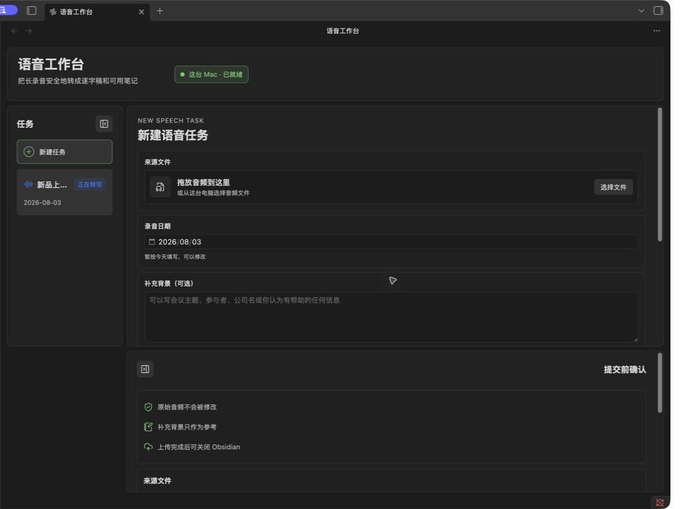
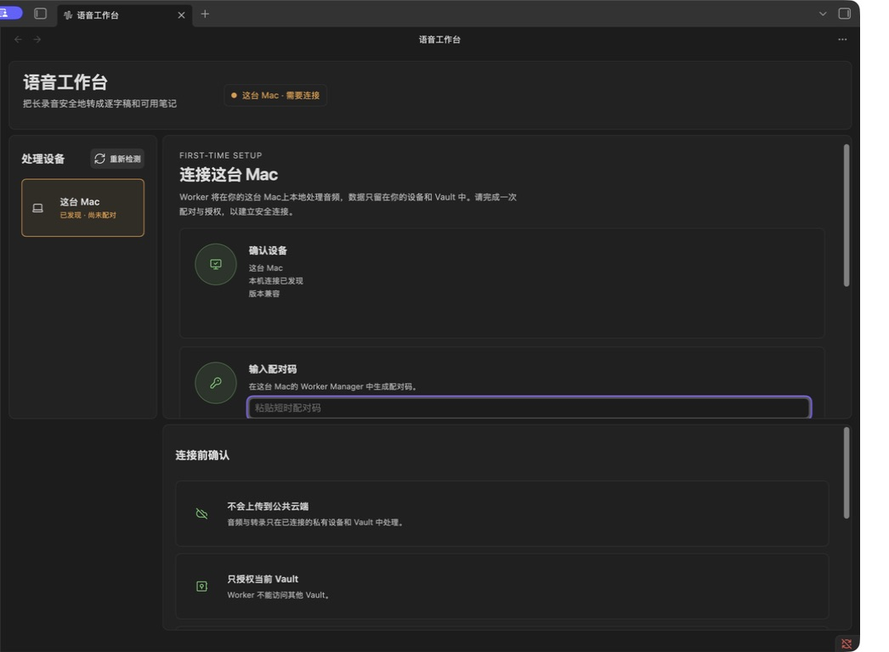
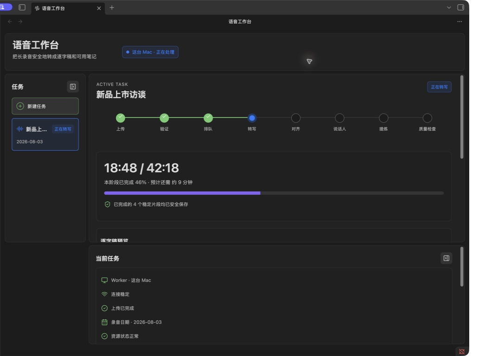
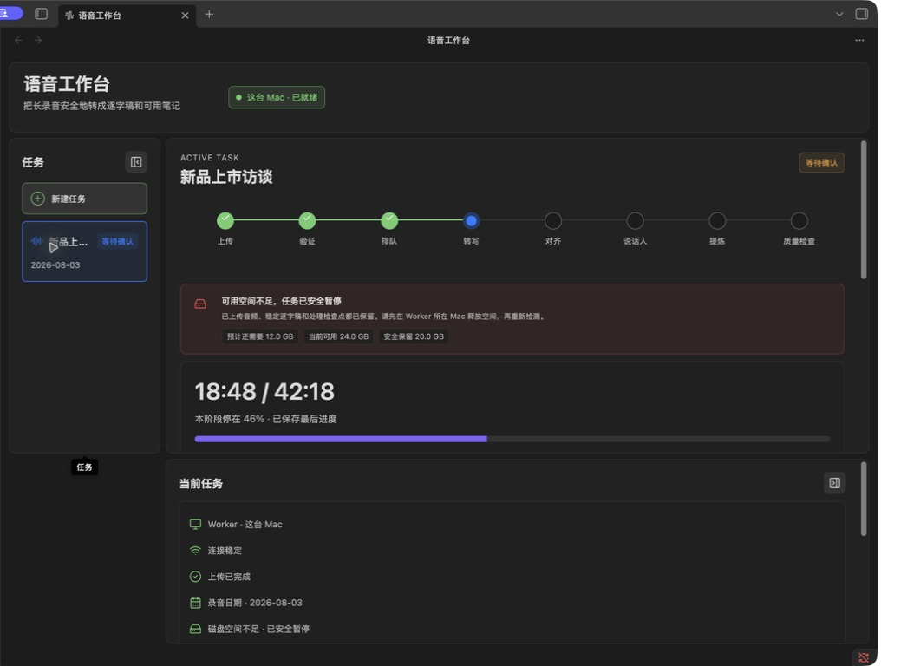
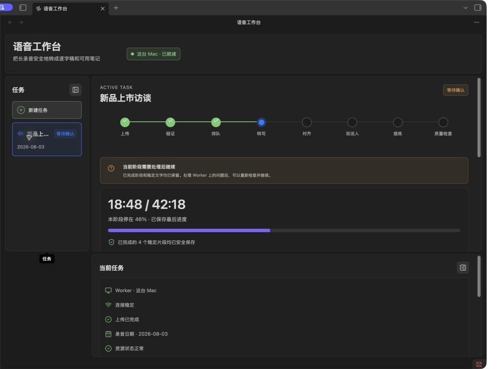
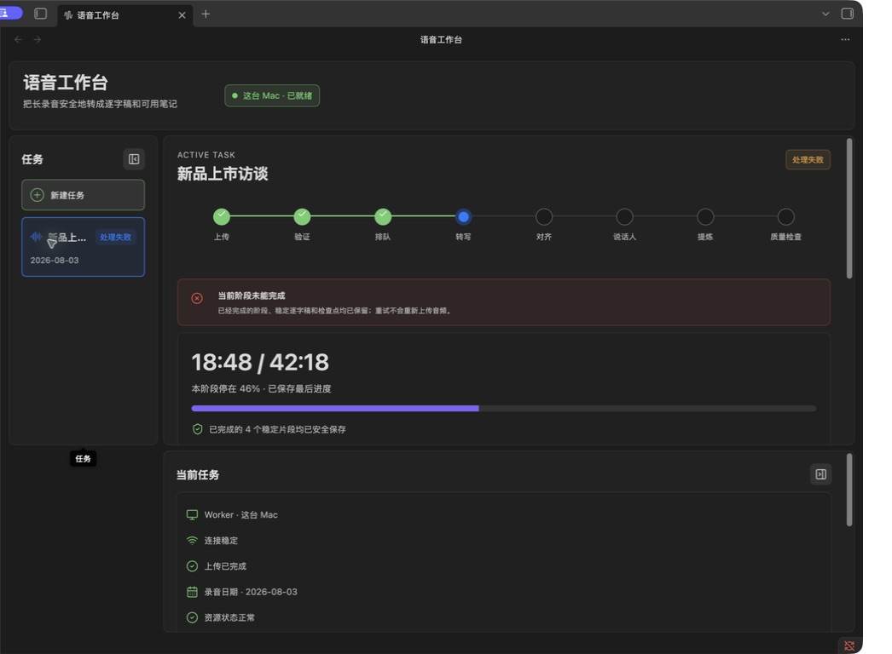
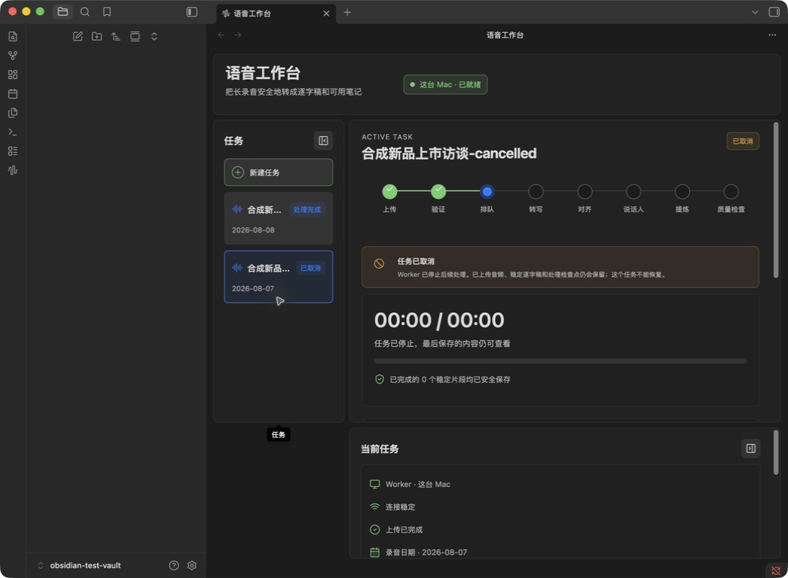
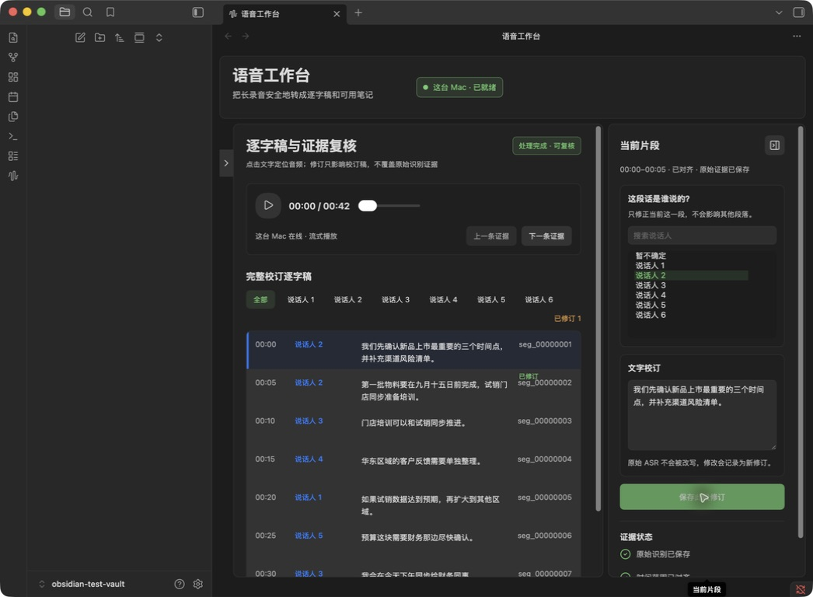
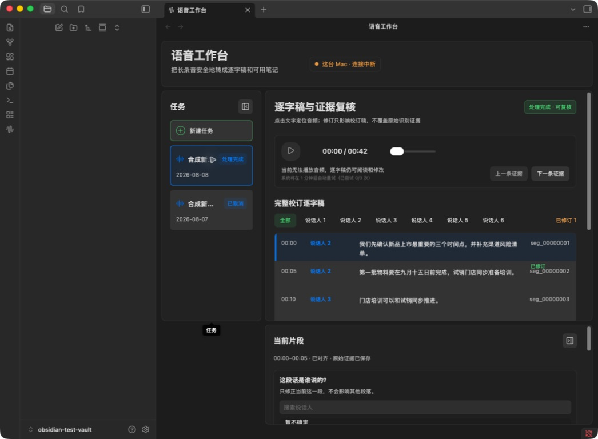
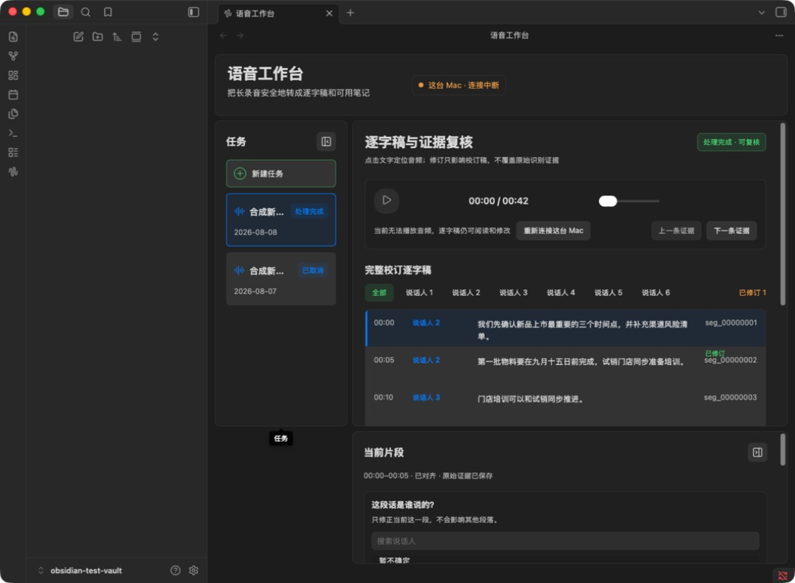

# Stage I · 首批真实 Obsidian 宿主验证 V1

日期：2026-08-03（2026-08-08 更新）
状态：新建任务、首次配对、处理中、磁盘阻断、安全暂停、等待用户、处理失败、取消终态以及
逐字稿与证据复核第一批均已完成真实宿主验证；尚未进入发布页验收。

## 验证边界

- 使用项目内、由 Git 忽略的独立测试 Vault；Vault 由项目所有者手动在现有 Obsidian 中打开；
- 不启动第二个 Obsidian 实例，不切换或读取正式 Vault；
- Worker、任务、文件名、日期和逐字稿均为本地合成数据，没有读取或重跑真实音频；
- 验证结束后已停止合成 Worker，并清除测试 Vault 的临时授权和 Worker 选择；
- 下列截图只含合成内容，可以进入 Git；测试 Vault、模拟 Worker 和运行数据继续留在 `tmp/`，不得
  提交。

## 正式实现截图

### 新建任务

- 验证单页提交、三栏层级、任务列表、自由文本背景、处理模式和提交前确认；
- 验证左右栏可分别或同时收起，且重新载入后延续上一次桌面状态；
- 修正紧凑宽度下左栏收起后主区被错误压缩的问题。

### 首次配对

- 验证一个配对码输入、当前 Vault 授权范围、Secret Storage 说明和连接动作；
- 修正输入配对码后主按钮仍保持禁用的问题；
- 修正配对页在 Obsidian Pane 中横向溢出的问题。

### 正在处理

- 验证阶段轨道、46% 进度、稳定片段、临时结果和当前任务动作；
- 处理中内容全部来自本地合成 Worker，不代表运行或重跑了真实任务；
- 当前 Pane 实测约 1250 px，因此使用批准的紧凑双栏重排；只有插件 Pane 大于 1480 px 时才使用
  完整三栏。响应式判断以插件 Pane 宽度为准，不再误用整个 Obsidian 窗口宽度。

## 本轮发现和修复

1. 栏目收起和紧凑断点发生冲突，导致左栏收起后主区被限制到 220 px；已为左栏收起、右栏收起和
   同时收起分别定义紧凑网格；
2. CSS 媒体查询只能看到应用窗口宽度，无法反映插件所在 Pane 的实际宽度；现由
   `ResizeObserver` 观察插件内容区，并统一映射为 `wide / compact / narrow`；
3. 配对码输入只更新内部状态，没有同步按钮可用性；现已即时启用连接按钮，并在重新输入时移除
   上一次错误提示。

## 中断与恢复状态

### 磁盘阻断

- 显示预计还需要、当前可用和安全保留三项真实 Worker 报告数值；
- 明确已上传音频、稳定逐字稿和处理检查点均保留；唯一恢复动作是右侧当前任务中的
  `重新检测空间`，不提供删除用户其他文件或自动清理的虚假能力。

### 安全暂停

- 区分用户主动安全暂停与处理失败，说明恢复后从已保存阶段继续；
- 唯一主动作是右侧当前任务的 `继续处理`，不再显示含义错误的 `在后台继续`。

### 等待用户处理

- 使用用户语言说明 Worker 问题需要处理后继续，不显示内部路径、异常堆栈或原始错误文本；
- Worker 问题处理后使用 `重新检查并继续`；无法解码的源文件则单独引导用其他音频新建任务。

### 处理失败

- 明确成功阶段、稳定逐字稿和检查点仍保留，重试不会重新上传音频；
- 唯一主动作是 `重试当前阶段`。

四种中断状态都继续显示最后稳定逐字稿，并使用 `progress.stage` 保持真正中断的处理阶段。真实宿主
验证曾发现等待/暂停/失败被错误画到 `质量检查`，现已修正并增加单元测试。中断后也不再显示仍在
运行的预计剩余时间，而是显示 `本阶段停在 46% · 已保存最后进度`。

## 验证结果与下一步

- 插件测试为 `36 passed`，严格类型检查和生产构建通过；Worker 为 `436 passed`，Ruff 与协议生成
  漂移检查通过；
- 没有强制启动、重启或并行打开 Obsidian；后续真实宿主验证继续只在这一个测试 Vault 中进行；
- 下一步继续逐字稿复核第一批的剩余边界：批量说话人显示名必须与单段归属分开，并继续验证
  Range 播放、本地同源文件优先和窄窗就地修订；发布页和 Stage J 仍不提前开始。

## 任务取消与不可恢复终态

- 只有仍可停止的活动任务显示 `取消任务`；确认弹窗明确停止 Worker 后续处理、保留已上传音频、
  稳定逐字稿和检查点，并说明取消后本任务不能恢复；
- 取消终态不再提供继续、重试或恢复动作，唯一后续动作是 `新建语音任务`；没有进度快照时停在
  尚未开始的阶段，不会误画到质量检查；
- 已取消任务仍显示最后保存的内容可查看，且不会改变原始音频或原始 ASR。

## 逐字稿与证据复核第一批

### Worker 在线

- 完整逐字稿按时间顺序显示，支持说话人筛选、选中片段、上一条/下一条证据以及普通时间滑杆；
- 当前片段使用完整可搜索说话人清单，合成样例验证六名说话人和 `暂不确定`，没有把人数写死为
  两人；文字与单段说话人归属由一个 `保存此段修订` 原子保存；
- 真实宿主保存验证把第一段同时改为 `说话人 2` 和新的合成文字。刷新后仍显示 `已修订 1`；原始
  ASR、原始说话人和数据库逐字稿均未改写，派生产物只叠加追加式修订；
- 本机同一提交会话保留的音频优先本地播放；否则使用 Worker 的鉴权 metadata 与 HTTP Range 只取
  当前片段所需 PCM 并组装小 WAV，不下载整段长音频。

### Worker 离线

- 关闭纯合成 Worker 后，顶部立即改为 `连接中断`，播放按钮和时间滑杆禁用；完整逐字稿、说话人
  选择和文字编辑仍保留；
- 首次断线显示 `当前无法播放音频，逐字稿仍可阅读和修改`，随后每隔 1 分钟自动尝试，最多 3 次；
  三次失败后才显示 Obsidian 内的手动重连入口；
- 宿主验证发现 Obsidian 网络错误原先会直接抛出，未进入既有恢复状态机。传输层现统一映射为不可用
  状态，JSON 与音频 Range 请求遵守同一离线边界。

- 真实等待三个一分钟重试窗口后，自动尝试停止，复核页在 Obsidian 内显示
  `重新连接这台 Mac`；没有 `稍后再试`，也不要求离开 Obsidian 操作。

### 本轮宿主问题与修复

1. 处理完成任务的 3 秒普通轮询会整页重绘并清空未保存输入；现在仅当任务 revision 或最新修订
   sequence 发生变化时重绘。真实宿主中输入合成草稿并等待超过轮询周期，草稿保持不变；
2. 初版长逐字稿行在紧凑 Pane 中发生文字重叠，已改为可换行网格，并保持片段 ID 与修订状态可读；
3. 复核页最初没有在连接失败时重绘，且传输异常未规范化；两层均已修复，离线截图验证通过；
4. 本轮只使用合成任务、合成文本和合成 WAV 字节；没有读取真实 Vault、真实音频或私有逐字稿。
