# Stage I · 首批真实 Obsidian 宿主验证 V1

日期：2026-08-03（2026-08-09 更新）
状态：新建任务、首次配对、处理中、磁盘阻断、安全暂停、等待用户、处理失败、取消终态、
逐字稿与证据复核、修订后重新生成笔记与总结差异，以及处理完成与 Vault 发布第一批均已完成
真实宿主验证；发布恢复边界也已完成，尚未进入 Stage J。

## 验证边界

- 使用项目内、由 Git 忽略的独立测试 Vault；Vault 由项目所有者手动在现有 Obsidian 中打开；
- 不启动第二个 Obsidian 实例，不切换或读取正式 Vault；
- Worker、任务、文件名、日期和逐字稿均为本地合成数据，没有读取或重跑真实音频；
- 每轮验证结束都停止合成 Worker。本轮开始前已清除上次遗留的测试 Secret；发布验证结束后再次
  清除本轮 Secret 和 Vault ID、撤销所有合成设备凭据，并确认 8765 无监听；
- 下列截图只含合成内容，可以进入 Git；测试 Vault、模拟 Worker 和运行数据继续留在 `tmp/`，不得
  提交。

## 正式实现截图

### 新建任务

- 验证单页提交、三栏层级、任务列表、自由文本背景、处理模式和提交前确认；
- 验证左右栏可分别或同时收起，且重新载入后延续上一次桌面状态；
- 修正紧凑宽度下左栏收起后主区被错误压缩的问题。

### 首次配对

- 验证一个配对码输入、当前 Vault 授权范围、Secret Storage 说明和连接动作；
- 修正输入配对码后主按钮仍保持禁用的问题；
- 修正配对页在 Obsidian Pane 中横向溢出的问题。

### 正在处理

- 验证阶段轨道、46% 进度、稳定片段、临时结果和当前任务动作；
- 处理中内容全部来自本地合成 Worker，不代表运行或重跑了真实任务；
- 当前 Pane 实测约 1250 px，因此使用批准的紧凑双栏重排；只有插件 Pane 大于 1480 px 时才使用
  完整三栏。响应式判断以插件 Pane 宽度为准，不再误用整个 Obsidian 窗口宽度。

## 本轮发现和修复

1. 栏目收起和紧凑断点发生冲突，导致左栏收起后主区被限制到 220 px；已为左栏收起、右栏收起和
   同时收起分别定义紧凑网格；
2. CSS 媒体查询只能看到应用窗口宽度，无法反映插件所在 Pane 的实际宽度；现由
   `ResizeObserver` 观察插件内容区，并统一映射为 `wide / compact / narrow`；
3. 配对码输入只更新内部状态，没有同步按钮可用性；现已即时启用连接按钮，并在重新输入时移除
   上一次错误提示。

## 中断与恢复状态

### 磁盘阻断

- 显示预计还需要、当前可用和安全保留三项真实 Worker 报告数值；
- 明确已上传音频、稳定逐字稿和处理检查点均保留；唯一恢复动作是右侧当前任务中的
  `重新检测空间`，不提供删除用户其他文件或自动清理的虚假能力。

### 安全暂停

- 区分用户主动安全暂停与处理失败，说明恢复后从已保存阶段继续；
- 唯一主动作是右侧当前任务的 `继续处理`，不再显示含义错误的 `在后台继续`。

### 等待用户处理

- 使用用户语言说明 Worker 问题需要处理后继续，不显示内部路径、异常堆栈或原始错误文本；
- Worker 问题处理后使用 `重新检查并继续`；无法解码的源文件则单独引导用其他音频新建任务。

### 处理失败

- 明确成功阶段、稳定逐字稿和检查点仍保留，重试不会重新上传音频；
- 唯一主动作是 `重试当前阶段`。

四种中断状态都继续显示最后稳定逐字稿，并使用 `progress.stage` 保持真正中断的处理阶段。真实宿主
验证曾发现等待/暂停/失败被错误画到 `质量检查`，现已修正并增加单元测试。中断后也不再显示仍在
运行的预计剩余时间，而是显示 `本阶段停在 46% · 已保存最后进度`。

## 验证结果与下一步

- 插件测试为 `37 passed`，严格类型检查和生产构建通过；Worker 为 `437 passed`，Ruff 与协议生成
  漂移检查通过；
- 没有强制启动、重启或并行打开 Obsidian；后续真实宿主验证继续只在这一个测试 Vault 中进行；
- 逐字稿复核第一批已经收口。下一步按 Stage I 既定顺序进入“修订后重新生成笔记”和总结差异的
  第一批实现；继续以 Stage H 已批准的桌面/窄窗稿为合同，暂不进入发布页或 Stage J。

## 任务取消与不可恢复终态

- 只有仍可停止的活动任务显示 `取消任务`；确认弹窗明确停止 Worker 后续处理、保留已上传音频、
  稳定逐字稿和检查点，并说明取消后本任务不能恢复；
- 取消终态不再提供继续、重试或恢复动作，唯一后续动作是 `新建语音任务`；没有进度快照时停在
  尚未开始的阶段，不会误画到质量检查；
- 已取消任务仍显示最后保存的内容可查看，且不会改变原始音频或原始 ASR。

## 逐字稿与证据复核第一批

### Worker 在线

- 完整逐字稿按时间顺序显示，支持说话人筛选、选中片段、上一条/下一条证据以及普通时间滑杆；
- 当前片段使用完整可搜索说话人清单，合成样例验证六名说话人和 `暂不确定`，没有把人数写死为
  两人；文字与单段说话人归属由一个 `保存此段修订` 原子保存；
- 真实宿主保存验证把第一段同时改为 `说话人 2` 和新的合成文字。刷新后仍显示 `已修订 1`；原始
  ASR、原始说话人和数据库逐字稿均未改写，派生产物只叠加追加式修订；
- 本机同一提交会话保留的音频优先本地播放；否则使用 Worker 的鉴权 metadata 与 HTTP Range 只取
  当前片段所需 PCM 并组装小 WAV，不下载整段长音频。

### Worker 离线

- 关闭纯合成 Worker 后，顶部立即改为 `连接中断`，播放按钮和时间滑杆禁用；完整逐字稿、说话人
  选择和文字编辑仍保留；
- 首次断线显示 `当前无法播放音频，逐字稿仍可阅读和修改`，随后每隔 1 分钟自动尝试，最多 3 次；
  三次失败后才显示 Obsidian 内的手动重连入口；
- 宿主验证发现 Obsidian 网络错误原先会直接抛出，未进入既有恢复状态机。传输层现统一映射为不可用
  状态，JSON 与音频 Range 请求遵守同一离线边界。

- 真实等待三个一分钟重试窗口后，自动尝试停止，复核页在 Obsidian 内显示
  `重新连接这台 Mac`；没有 `稍后再试`，也不要求离开 Obsidian 操作。

### 本轮宿主问题与修复

1. 处理完成任务的 3 秒普通轮询会整页重绘并清空未保存输入；现在仅当任务 revision 或最新修订
   sequence 发生变化时重绘。真实宿主中输入合成草稿并等待超过轮询周期，草稿保持不变；
2. 初版长逐字稿行在紧凑 Pane 中发生文字重叠，已改为可换行网格，并保持片段 ID 与修订状态可读；
3. 复核页最初没有在连接失败时重绘，且传输异常未规范化；两层均已修复，离线截图验证通过；
4. 本轮只使用合成任务、合成文本和合成 WAV 字节；没有读取真实 Vault、真实音频或私有逐字稿。

### 批量说话人显示名

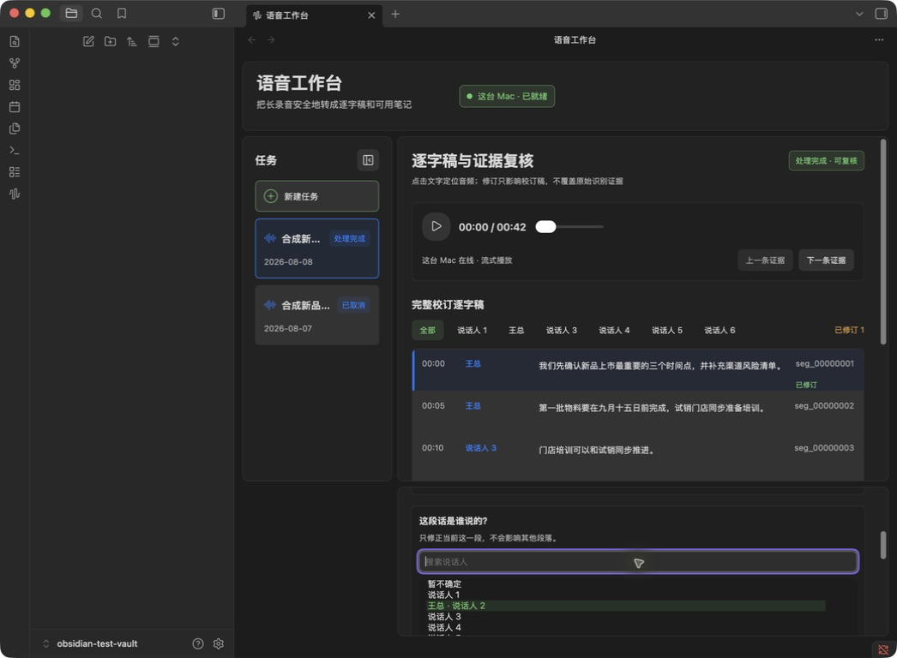

- 新增独立的 `批量改显示名`：它只把同一匿名说话人的人物标签改为用户输入的名称，不改变任何
  逐字稿片段的说话人归属；`这段话是谁说的？` 继续只处理当前片段，两种操作没有合并成一个含义
  模糊的按钮；
- 合成样例把匿名 `说话人 2` 显示为 `王总` 后，说话人筛选、相关逐字稿行、批量改名选择器和当前
  片段归属选择器同步更新；六名说话人和 `暂不确定` 仍全部存在；
- 搜索框在普通轮询或播放触发的重绘后曾保留文字却恢复全部选项，现已在每次绘制后立即重放筛选
  条件；真实宿主验证 `说话人 6` 时只保留匹配项和 `暂不确定`；
- Worker 数据库只新增追加式 `speaker_display_name` 修订。只读核验确认原始
  `transcript_segments.speaker_id` 与原始文字没有变化，第一段的单段复核仍由独立
  `segment_review` 记录表达。

### Range 播放与窄窗口

- 合成复核音频通过真实 Worker 元数据请求返回 `200`，字节请求返回标准 `206 Partial Content` 和
  正确 `Content-Range`；在 Obsidian 点击当前片段播放后不再出现连接或音频错误。宿主验证同时暴露
  并修正了合成音频检查点的源哈希和 30 秒分块边界错误，这些修正只存在于 Git 忽略的测试夹具；
- 当前提交会话若仍保留原始 `File`，播放器代码会在任何 Worker metadata/Range 请求之前使用本地
  object URL；本轮为避免新增任务和扩大宿主状态，没有再创建一项上传任务，因此这一优先顺序按
  确定性代码路径与既有构建检查确认，不把它误写为新一轮宿主上传验收；
- 第一次缩窄真实 Obsidian 窗口时发现旧的右侧 `当前片段` 栏与行内编辑器同时显示。响应式规则已
  修正为窄窗只保留选中段落下方的行内编辑器，删除重复侧栏。

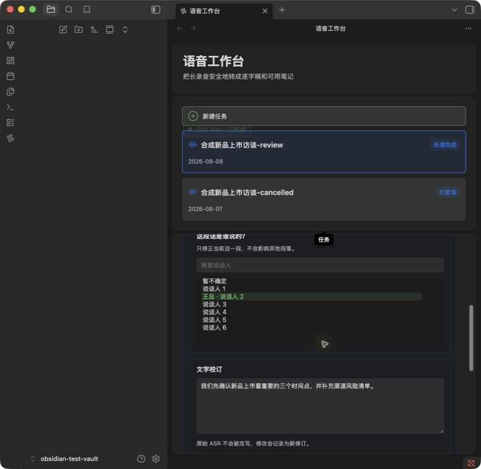

- 无障碍树顺序确认编辑器紧接选中逐字稿行，随后才是下一段；页面没有把修订区放到全文末尾，
  也没有把桌面右栏压缩成难读的窄列；
- 验证结束后已停止合成 Worker，确认 8765 无监听；Obsidian Keychain 中测试 Secret 已删除，三个
  合成 Worker 设备凭据均已撤销，Vault ID 和首选 Worker 已清空，测试插件已停用。独立测试 Vault、
  合成 Worker、数据库和 WAV 继续只留在 Git 忽略的 `tmp/`。

## 修订后重新生成笔记与总结差异第一批

### 候选版本与桌面差异

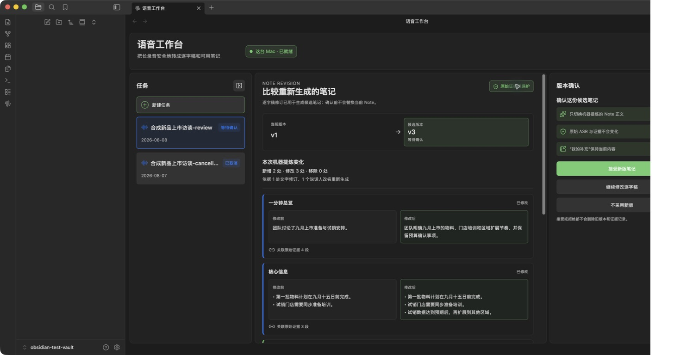

- 逐字稿出现新的文字或说话人修订后，复核页显示 `重新生成笔记`；生成结果先成为候选版本，确认前
  不替换当前 Note，也不改原始 ASR；同一批修订只允许生成一个待确认候选；
- 桌面页按已批准稿显示当前版本、候选版本、新增/修改/移除计数、逐章节前后内容和关联证据段数；
  右栏只提供 `接受新版笔记`、`继续修改逐字稿`、`不采用新版` 三个已批准动作；
- `我的补充` 从当前 `note.md` 单独读取并显示为受保护区域。接受候选时只替换机器正文，不采用时
  当前版本不变；两种决定都保存只读记录，不删除旧版本、候选或证据；
- 本轮真实宿主采用合成任务生成 v1→v2 和 v1→v3 两个候选，并均以 `不采用新版` 结束；当前使用
  始终为 v1。只读核验确认结构化 checkpoint 已恢复到候选前内容。

### 窄窗口与只读记录

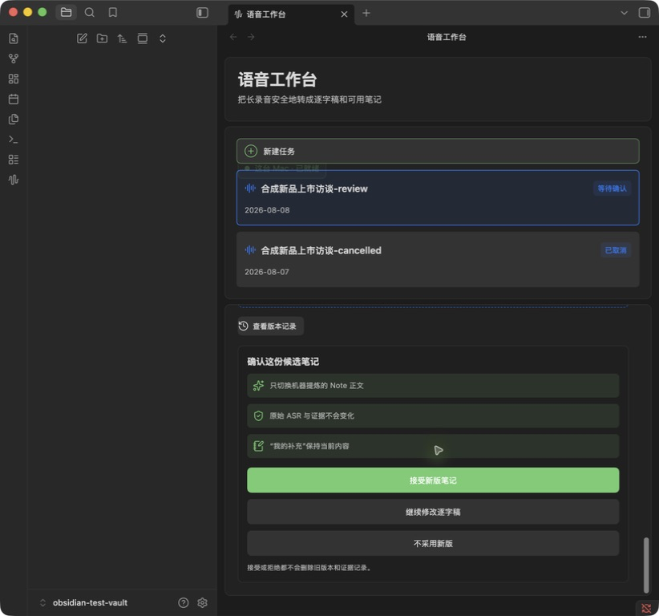

- 窄窗口不保留压缩后的右栏；每个变化改为纵向阅读，三个版本动作在差异正文末尾以内联卡片出现；
- 真实缩窄同一个 Obsidian 窗口时曾发现布局断点只更新内部尺寸、没有重新绘制，导致底部操作卡缺失；
  `ResizeObserver` 现在只在 `wide / compact / narrow` 断点变化时触发重绘，普通尺寸抖动不清空草稿；
- 候选被采用或不采用后，逐字稿页仍提供 `版本记录` 入口。记录页显示 `当前使用`、`已采用/未采用`
  和 `查看差异`，不提供回滚、删除或逐条合并；
- 初次宿主对照截图 `14` 至 `17` 保留了桌面、窄窗与记录页的发现过程；标题、标签和三个按钮状态
  以 `18`、`19` 以及 Stage H 消息目录为准。按钮后果说明随后进一步对齐消息目录并通过构建，因
  Mac 自动锁屏未重复截取同一页面；

### 数据与回归核验

- 原始 `transcript_segments` 第一段仍是合成 ASR 原文和原始 `speaker_id`；三次后续文字变化与
  `王总` 显示名都只存在追加式修订记录中；
- 两个候选的决策 checkpoint 均为 `rejected`，当前结构化摘要仍是候选前文本；合成 `note.md` 的
  `我的补充` 内容及文件哈希在生成和决定前后保持不变；
- Worker 全套 `442 passed`，Ruff 与协议生成漂移检查通过；插件 `41 passed`，严格类型检查和生产
  构建通过；所有正式截图只含合成数据，测试 Vault、数据库、WAV、凭据和模拟 Worker 仍在 Git
  忽略的 `tmp/` 中。

总结差异批次到此收口时尚未进入发布页或 Stage J；当时遗留的测试 Secret 已在下述发布批次开始前
清除。全过程都没有读取正式 Vault、真实音频、真实逐字稿或私有 Note。

## 处理完成与 Vault 发布第一批

### 自动无冲突发布

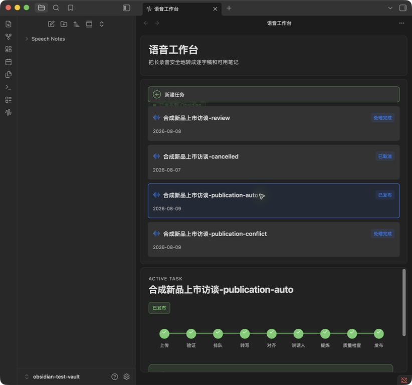

- 处理完成且没有待确认总结候选时，已授权 Obsidian 客户端自动读取 Worker 的校验清单；目标位置
  不存在时先把完整七文件包写入同级隐藏临时目录，逐文件校验后一次性改名到正式目录，再做最终
  校验和 Worker 回执；
- 合成自动发布任务最终显示 `已发布到 Obsidian` 和 `打开 Note`。Vault 中恰好生成
  `transcript.raw.json`、`transcript.md`、`speech-record.json`、`note.md`、`note.evidence.md`、
  `timeline.md` 与 `artifact-manifest.json` 七个文件；逐文件 SHA-256 与 Worker 私有包完全一致；
- Worker 的持久租约从 `processed` 推进到 `publishing`，只有写入和最终校验完成后才记录
  acknowledgement 并进入 `published`。绝对 Vault 路径、其他设备 ID 和凭据都不出现在协议响应。

### 冲突先查看差异

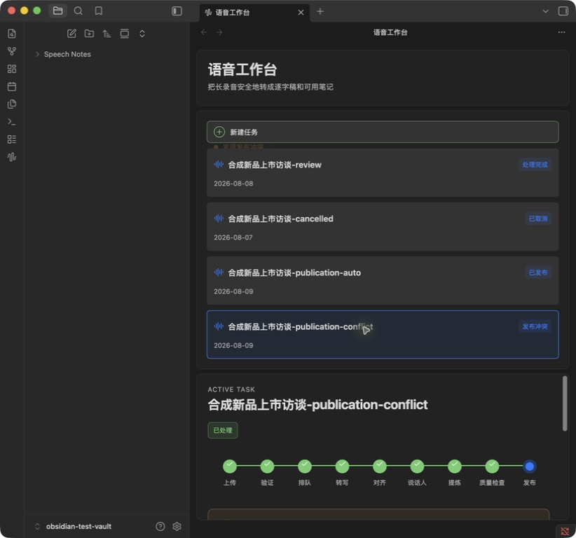

- 在第二个纯合成任务的目标目录中预先放入一份不同的人工 `note.md`。插件检测到不同内容后没有
  取得发布租约，也没有写入任何 Worker 文件；首屏唯一推进动作是 `查看差异`，没有
  `稍后处理`、覆盖、逐条合并或隐藏保存动作；
- 顶部状态与左侧任务卡同步显示 `发现发布冲突 / 发布冲突`；页面明确当前 Vault 内容和 Worker
  待发布版本均未被覆盖。

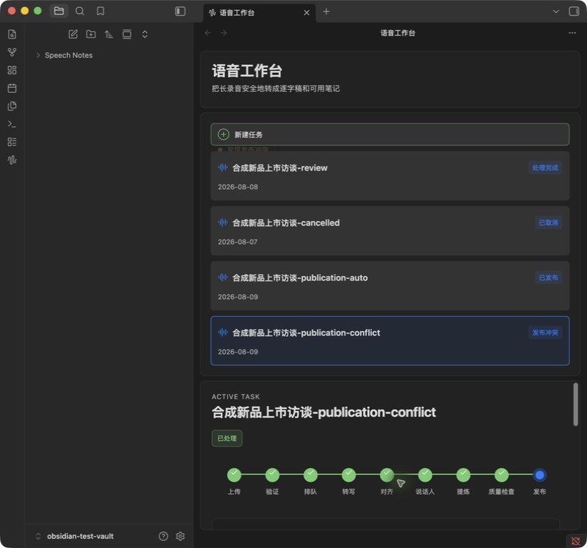

- 查看后并排显示当前 Note 与 Worker Note 的合成差异，并说明当前位置、Worker 版本和最终校验三项
  安全边界；只有此时才出现 `保存到新位置`，同时保留 `返回冲突说明`；
- 保存后原目标目录仍只有用户预置的 `note.md`，两条合成人工内容逐字保持；新建带 `（新）` 后缀
  的同级目录并写入完整七文件包，Worker 回执只指向新目录。

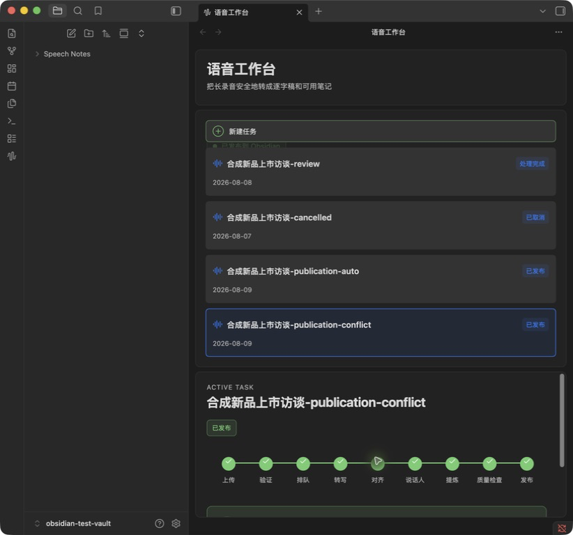

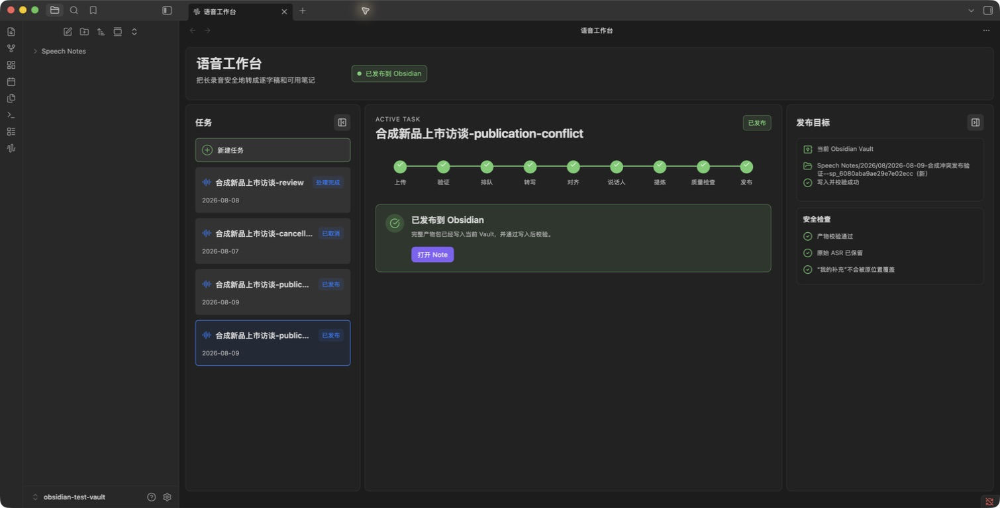

- 同一个 Obsidian 实例在窄窗口使用纵向布局，放大后恢复 Stage H 已批准的左侧任务、中间发布结果、
  右侧发布目标三栏；左右栏仍沿用已批准的独立收起机制；
- 本批只使用 Git 忽略的合成 Worker、合成任务、合成 Note 和同一个独立测试 Vault。没有运行或读取
  真实音频，没有打开正式 Vault，没有启动第二个 Obsidian，也没有进入 Stage J；
- 最终回归为 Worker `443 passed`、插件 `48 passed`；Ruff、严格类型检查、生产构建、协议生成与
  差异格式检查通过。测试 Secret 和 Vault ID 已清除，五个历史/本轮合成设备凭据均已撤销，合成
  Worker 已停止且 8765 无监听。`tmp/`、测试 Vault、数据库和构建产物继续由 Git 忽略。

## Vault 发布恢复边界

### 另一台设备持有发布租约

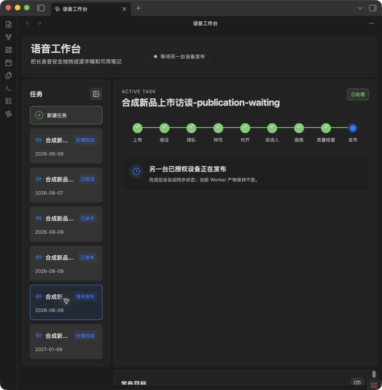

- 使用新的纯合成任务，由模拟的另一台已授权设备先取得持久发布租约；当前 Obsidian 客户端没有
  争抢租约、写入文件或暴露另一台设备的身份，只显示 `另一台已授权设备正在发布`；
- 页面明确说明完成后会自动同步、Worker 产物保持不变；左侧任务卡和顶部状态同步显示等待发布，
  没有手动接管、覆盖或 `稍后处理`。

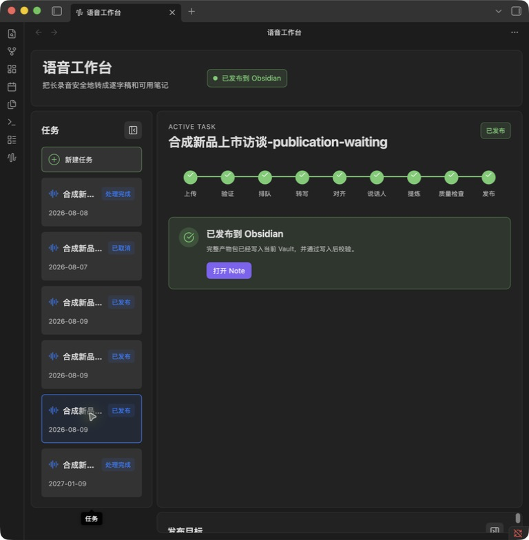

- 模拟他端使用同一租约把完整七文件包原子写入测试 Vault 并确认 Worker；当前页面保持打开，约一个
  三秒轮询周期后无需用户操作自动切换为 `已发布到 Obsidian`；
- 目标目录恰好包含七个正式文件，和 Worker 包逐文件一致；租约状态为 `acknowledged`，回执指向
  同一 Vault 相对路径，没有遗留隐藏临时目录。

### 写入失败与 Obsidian 内重试

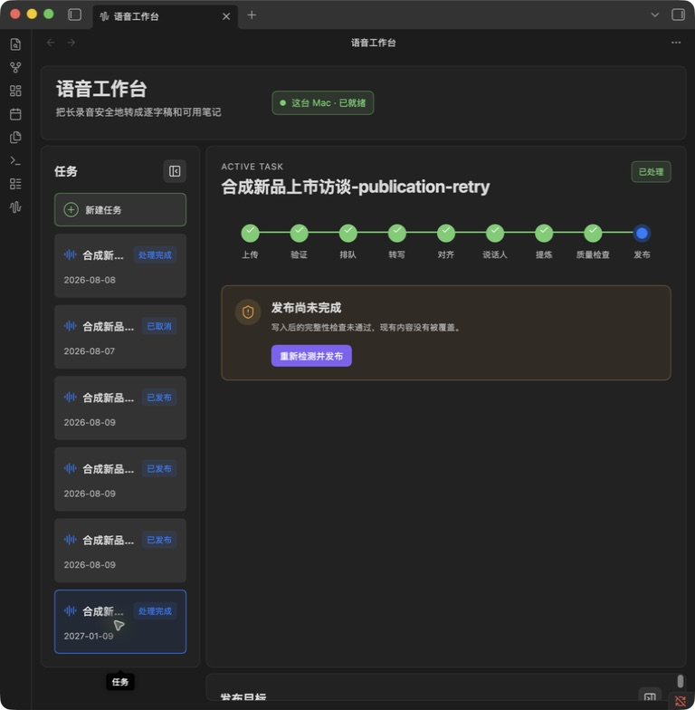

- 在新的纯合成任务日期路径放置同名普通文件，确定性制造写入路径不可用；自动发布在形成正式目标
  前失败，页面显示 `发布尚未完成`、`现有内容没有被覆盖` 和唯一动作 `重新检测并发布`；
- 只读核验确认阻挡文件两行内容逐字不变，目标目录没有创建，隐藏临时目录没有遗留，Worker 任务
  仍为 `processed`，没有租约和发布回执。

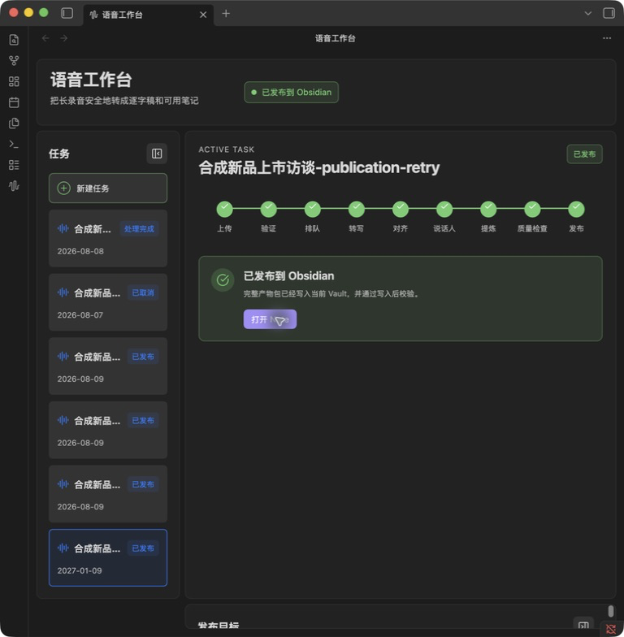

- 移除合成阻挡条件后，只点击 Obsidian 页内的 `重新检测并发布`，不离开应用、不使用第二个
  Obsidian；任务正常取得租约、写入、最终校验并确认；
- 最终目录七文件与 Worker 私有包 `diff -qr` 完全一致，无 `.tmp` 目录；回执发布者为本轮测试
  Obsidian 设备，目标为规范化 Vault 相对路径。

### 本轮边界结论

- Stage H 已批准的两条简单恢复合同均通过真实宿主验收；没有增加接管、覆盖、逐条合并、复杂历史
  或 `稍后处理`；
- 全程只使用当前书房 Mac、唯一 Obsidian 实例、同一个独立测试 Vault 和纯合成数据；没有打开正式
  Vault、运行真实音频、启动远程笔记本验证或进入 Stage J；
- 本轮只补 Git 忽略的合成任务夹具和四张不含私有内容的截图，没有修改产品代码。验证结束后撤销
  本轮测试设备凭据、清除测试 Vault Secret/Vault ID，并停止合成 Worker。
